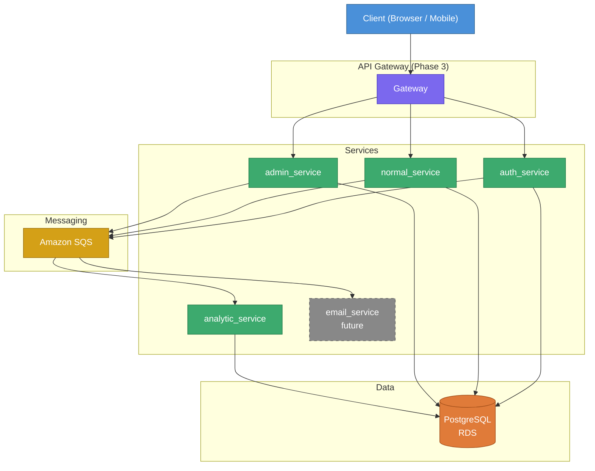

# ecommerceWebsite

Microservice-based e-commerce backend. Spring Boot + PostgreSQL + Amazon SQS.

---

## Architecture

---

## Services

### auth_service
- Login, logout, session management
- Two-factor / OTP verification
- JWT token generation and refresh
- Touches only: `users` table

### normal_service
- Browse and search products
- Cart operations (add / remove / update)
- Order placement and confirmation
- General user-facing flows

### admin_service
- Seller registration and product listing
- Super-admin approval workflow for new products
- Stock tracking and inventory edits

### analytic_service
- Consumes events from all services via SQS
- Logs API requests to DB
- Planned: GraphDB-based user activity recommendations

### email_service *(future)*
- SQS consumer
- OTP delivery and order notification emails

---

## Stack

| Layer | Tech |
|---|---|
| Framework | Spring Boot |
| ORM | Hibernate / JPA |
| Database | PostgreSQL (Amazon RDS) |
| Messaging | Amazon SQS |
| Auth | Spring Security + JWT |

---

## Roadmap

- [x] **Phase 1** — DB schema, REST endpoints, entity mappings
- [ ] **Phase 2** — Spring Security, SQS integration, email_service
- [ ] **Phase 3** — API Gateway
- [ ] **Phase 4** — Cloud deployment (AWS)
